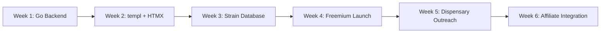
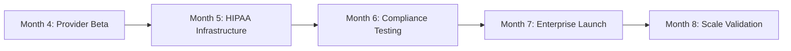

# CLAUDE.md

This file provides guidance to Claude Code (claude.ai/code) when working with code in this repository.

## Development Commands

- `npm run dev` - Start development server with Tailwind CSS compilation and nodemon auto-reload
- `npm run tailwind:css` - Compile Tailwind CSS from source to output file
- `npm start` - Start production server (node server.js)

## Architecture Overview

CannaNote is an Express.js web application for cannabis experience journaling with the following structure:

**Core Architecture:**
- **MVC Pattern**: Controllers handle business logic, models define data schemas, views render EJS templates
- **Session-based Authentication**: Uses express-session with MongoDB store (connect-mongo)
- **Database**: MongoDB with Mongoose ODM
- **Frontend**: EJS templating with Tailwind CSS for styling
- **Middleware**: Custom middleware in `middleware/mid.js` handles common setup

**Route Structure:**
- `/` - Unauthenticated routes (login, signup, marketing pages)
- `/cannanote` - Main application routes (entries CRUD) - requires authentication
- `/htmx` - HTMX-specific routes for dynamic interactions

**Key Models:**
- `Entry`: Cannabis experience entries with strain, type, amount, consumption method, description, and metadata (votes, favorites)
- `User`: User accounts for authentication

**Authentication Flow:**
- Unauthenticated users see marketing/login pages via `routes/unauth.js`
- All `/cannanote` routes require session authentication via middleware check
- Sessions stored in MongoDB with automatic cleanup

**Frontend Architecture:**
- EJS views in `views/` with reusable partials in `views/partials/`
- Tailwind CSS compilation from `public/css/tailwind.css` to `public/css/style.css`
- Static assets served from `public/` directory
- HTMX integration for dynamic interactions

## Environment Setup

Required environment variables:
- `DATABASE_URL` - MongoDB connection string
- `SECRET` - Session secret key
- `PORT` - Server port (defaults to 3001)

## Database Schema

**Entry Schema** (`models/entries.js`):
- username, strain, type, amount, consumption, description
- date (auto-generated), tags array
- meta object with votes and favorites count

## Styling System

- Tailwind CSS configured to scan `views/**/*.ejs` files
- Source file: `public/css/tailwind.css`
- Output file: `public/css/style.css` (compiled via npm script)
- PostCSS configuration in `postcss.config.js`

---

# CannaNote 2.0 Strategic Direction

## Business Model Evolution & System Rewrite

**IMPORTANT**: We're building a lifelong opus project with hexagonal architecture as the primary pattern for maximum flexibility and maintainability. Using go-blueprint for initial scaffolding, then redesigning to hexagonal structure for velocity with purpose.

## Brand Messaging Guidelines

**Core Terminology:**
- **"Humans"** - Never use "users". Our platform serves humans with real medical needs and cannabis experiences.
- **"Cannabis journey"** - Personal experience tracking and optimization
- **"Medical cannabis care"** - Healthcare-focused positioning for B2B
- **"Wellness optimization"** - Bridge between recreational and medical positioning

**Brand Voice:**
- Respectful of medical necessity
- Non-judgmental about cannabis use
- Professional but approachable
- Evidence-based and compliant

## Phased Go-to-Market Strategy

### Phase 1: Recreational Cannabis Tracking (Weeks 1-12) 
**Target**: Adult-use recreational cannabis humans in legal states
**Legal Position**: No medical claims, no PHI, recreational tracking only
**Technology**: Go MVP from day 1 using go-blueprint + hexagonal architecture redesign

#### Revenue Strategy
- **SaaS Tiers**: Free / $5/month / $15/month
- **B2B Launch**: Dispensary analytics tools by Week 8 ($100-500/month)
- **Target**: 500 humans + 3 dispensary partners by Month 2
- **Infrastructure Cost**: <$50/month (Fly.io free tier + Supabase free)

#### Marketing Approach
- **Primary Message**: "Track Your Cannabis Journey"
- **Channels**: SEO, cannabis lifestyle content, Reddit communities
- **Content**: Strain guides, effects databases, dispensary integrations
- **B2B Outreach**: Direct dispensary partnerships for analytics

#### Development Tasks
```
Week 1-2: Go backend with templ templates + HTMX interactions
Week 3-4: Strain database integration + freemium SaaS launch
Week 5-6: Dispensary partnership outreach + affiliate integration
```

### Phase 2: Wellness Expansion (Months 3-9)
**Target**: Scale individual humans + dispensary B2B partnerships  
**Legal Position**: Wellness tracking without medical claims
**Technology**: Expand Go hexagonal architecture; add wellness features; modular monolith

#### Revenue Strategy
- **Individual Tiers**: $0/$5/$15/month (focus on premium exports/sharing)
- **B2B Analytics**: $100-500/month per dispensary partnership
- **Target**: 2,000 humans + 8 dispensary partners = $8,000 MRR by Month 4
- **Infrastructure Cost**: <$200/month (Supabase Pro tier)

#### Marketing Evolution
- **Primary Message**: "Cannabis & Wellness Lifestyle"
- **Dual Channels**: Individual (content/SEO) + B2B (direct outreach)
- **Content**: Sleep/mood tracking, strain effectiveness analytics
- **B2B Value**: Anonymized customer insights, inventory optimization

#### Development Tasks
```
Week 6-10: B2B analytics dashboard for dispensaries
Week 10-14: Mood/sleep tracking + affiliate integration  
Week 14-16: Content marketing automation + partnership scaling
```

### Phase 3: Enterprise Platform (Month 4-8)
**Target**: Healthcare providers + medical cannabis patients
**Legal Position**: Full HIPAA compliance only when provider partnerships confirmed
**Technology**: Go stack + Supabase HIPAA add-on + Fly.io BAA

#### Revenue Strategy
- **Enterprise B2B**: $100K-500K healthcare system contracts
- **Medical Platform**: $0/$42/$71/year for patient platform
- **Target**: 5,000+ humans + 2 healthcare partners = $30,000+ MRR by Month 8
- **Infrastructure Cost**: $300-800/month (Supabase HIPAA + Fly.io BAA)
- **Activation Trigger**: Confirmed provider partnerships OR $20K MRR threshold

#### Marketing Transformation
- **Primary Message**: "HIPAA-Compliant Medical Cannabis Care Platform"
- **B2B Focus**: Healthcare conferences, provider partnerships
- **Compliance**: SOC2 certification, medical research partnerships
- **Risk Mitigation**: Separate legal entity (CannaNote Medical Inc)

## Go-to-Market Workflow Detail

### Week 1-6: Go MVP Launch


**Key Metrics:**
- Human acquisition cost (CAC) target: <$20
- Weekly active humans (WAH)  
- Revenue per human (RPH)
- Dispensary partnership conversion rate

### Week 6-16: Dual Revenue Scaling


**Go Stack Milestones:**
- [ ] Go + templ + HTMX MVP deployed to Fly.io
- [ ] Supabase integration with RLS policies  
- [ ] B2B analytics dashboard for dispensaries
- [ ] Casbin RBAC for future compliance prep
- [ ] Zap structured logging implementation

### Month 4-8: Enterprise Platform (HIPAA Activation)


**HIPAA Activation Checklist (Only when $20K MRR OR confirmed provider partnerships):**
- [ ] Supabase HIPAA add-on activated ($350+/month)
- [ ] Fly.io BAA signed ($99/month)
- [ ] Field-level encryption for PHI implemented
- [ ] Comprehensive audit logging deployed
- [ ] Provider portal with BAAs established

## Revenue Protection Strategy

### Legal Structure
```
CannaNote Lifestyle LLC
├── Recreational cannabis tracking
├── Wellness lifestyle features  
├── Technology licensing
└── Compliance tools as products

CannaNote Medical Inc  
├── HIPAA-compliant medical platform
├── Healthcare provider partnerships
├── Medical research collaborations
└── Enterprise B2B contracts
```

### Risk Mitigation
- **Regulatory Monitoring**: Federal/state law change alerts
- **Pivot Capability**: Platform works for any wellness tracking
- **Multiple Revenue Streams**: Reduces dependency on cannabis market
- **Open Source Strategy**: Community adoption reduces competitive risk

## Technology Migration Timeline

### Current State (Express/MongoDB)
```
cannanote/
├── Express.js server
├── MongoDB with Mongoose
├── EJS templates
├── Session-based auth
└── Basic HTMX integration
```

### Target State (Go/Supabase)
```
cannanote-go/
├── Go microservices
├── Supabase PostgreSQL (HIPAA)
├── HTMX + Go templates  
├── OAuth + RLS security
├── Docker containerization
├── Fly.io deployment
└── Compliance monitoring stack
```

### Migration Phases
1. **Phase 1**: Parallel Go services (auth, entries) behind proxy
2. **Phase 2**: HTMX frontend migration to Go templates
3. **Phase 3**: Data migration MongoDB → Supabase
4. **Phase 4**: Legacy system deprecation

## Success Metrics by Phase

### Phase 1 Success Criteria (Week 1-6)
- [ ] 500 active humans
- [ ] $2,000 Monthly Recurring Revenue  
- [ ] 3+ dispensary partnership discussions initiated
- [ ] <$20 human acquisition cost
- [ ] Go MVP deployed and stable

### Phase 2 Success Criteria (Week 6-16)
- [ ] 2,000 active humans
- [ ] $8,000 Monthly Recurring Revenue
- [ ] 8+ dispensary partners generating B2B revenue
- [ ] B2B analytics dashboard generating $100-500/month per partner

### Phase 3 Success Criteria (Month 4-8)
- [ ] 5,000+ active humans  
- [ ] $30,000+ Monthly Recurring Revenue
- [ ] HIPAA compliance activated (when triggered)
- [ ] 2+ healthcare provider partnerships confirmed

## Development Commands (Updated)

**Go Hexagonal Stack (Primary Development):**
- `make dev` - Start Go development server with templ hot reload
- `make build` - Build production binary with go-blueprint base
- `make test` - Run Go test suite with 80%+ coverage requirement
- `make lint` - Run golangci-lint with opinionated rules
- `make security` - Run Trivy security scans
- `make deploy` - Deploy to Fly.io
- `docker-compose up` - Local development with Supabase CLI + monitoring stack

## Architecture Evolution Path

### Hexagonal Architecture (Lifelong Opus Design)
```
Technology Stack:
├── Backend: Go 1.22+ with Gin router (go-blueprint base)
├── Templates: templ (type-safe, component-based) 
├── Frontend: HTMX + Tailwind CSS (server-rendered, hypermedia/HATEOAS)
├── Database: Supabase PostgreSQL with RLS
├── Auth: Supabase Auth (Google/Microsoft OAuth planned)
├── Deployment: Docker + Fly.io (HIPAA add-on later)
├── Secrets: Fly.io built-in
├── Logging: Zap, RBAC: Casbin, Security: Trivy scans
└── Build: Make (not Mage), golangci-lint, 80%+ coverage
```

**Project Structure (Hexagonal/DDD Monorepo):**
```
cannanote-go/
├── go.mod                  # Single module root for dependency management
├── Makefile               # Build tasks (not Mage) - test, lint, build, deploy
├── .golangci.yml          # Linter config - opinionated rules, cyclomatic complexity <10
├── docker/                # Containerization for dev/prod consistency
│   ├── Dockerfile         # Multi-stage builds
│   └── docker-compose.yml # Local dev with Supabase CLI
├── fly.toml               # Fly.io deployment config
├── cmd/                   # Entry points - start monolithic, extract for modular monolith
│   ├── server/            # Main app binary (MVP - wires all adapters)
│   ├── auth/              # Future service binary (OAuth/JWT)
│   └── entries/           # Future journaling service (scales independently)
├── internal/              # Private packages (Go enforces no external imports)
│   ├── core/              # Pure domain logic - isolated, no dependencies on adapters
│   │   ├── domain/        # Entities/aggregates (Human, Entry, Strain) - pure structs
│   │   ├── ports/         # Interfaces (HumanRepository, EntryRepository) - decouples from tech
│   │   └── application/   # Use cases/services - orchestrates domain + ports
│   ├── adapters/          # Concrete implementations - bridge external tech to ports
│   │   ├── repository/    # Persistence - Supabase implementations with RLS
│   │   ├── http/          # API - Gin handlers with HATEOAS links
│   │   └── logging/       # Zap adapter for audit logs
│   └── config/            # Environment/secrets loading
├── web/                   # Frontend assets - server-rendered for HTMX
│   ├── templates/         # templ files - type-safe components
│   └── static/            # Tailwind CSS/minimal JS
├── tests/                 # Integration/e2e tests - 80%+ coverage enforced
├── scripts/               # Helpers - migrate.sh for Supabase schema
└── .github/workflows/     # CI/CD - lint/test/build/deploy to Fly.io
```

### Infrastructure Cost Evolution
```
Phase 1 (Week 1-6): <$50/month
├── Fly.io: Free tier (shared resources)
├── Supabase: Free tier (500MB, 50K MAU)
├── Sentry: Free tier (5K errors/month)
└── Domain/CDN: $10-20/month

Phase 2 (Week 6-16): <$200/month  
├── Fly.io: $20-50/month (dedicated resources)
├── Supabase: Pro tier $25/month
├── Monitoring: Free tiers sufficient
└── B2B tools: Self-funding growth

Phase 3 (Month 4-8): $300-800/month
├── Fly.io: $99/month (BAA for HIPAA)
├── Supabase: $350+/month (HIPAA add-on)
├── Enterprise tooling: $100-300/month
└── Activated only when $20K MRR threshold hit
```

## Human Management Domain (Foundation)

**Primary Domain Implementation:**
```
Human Management (core/domain):
├── Authentication: Supabase Auth integration (email + OAuth ready)
├── Profile Management: Cannabis preferences, privacy settings
├── Authorization: Role-based access control (human/admin/provider)
└── Consent Management: Privacy controls (future HIPAA compliance prep)
```

**HIPAA-Safe Data Collection (Phase 1):**
```
Safe to Collect (No PHI):
├── Username, email (standard account info)
├── Cannabis preferences (strains, consumption methods)
├── Experience tracking (effects, mood - self-reported recreational use)
├── Privacy settings (public profile, data sharing consent)
├── Dispensary affiliations (for B2B partnerships)
└── Usage analytics (anonymized for insights)

Avoid Until HIPAA (Phase 3):
├── Medical diagnoses or conditions
├── Physician names or medical records
├── Insurance information
├── Prescription details
└── Any data tied to "treatment" or "medical necessity"
```

**Dependency Injection Strategy:**
- **No formal DI framework** (security best practice)
- Simple constructor injection (pass interfaces as parameters)  
- Manual wiring in cmd/server/main.go (explicit, secure)
- Testable through interface mocking (no magic, no reflection)

**External Auth Providers (Planned):**
- Google OAuth integration (interfaces designed, implementation deferred)
- Microsoft OAuth integration (interfaces designed, implementation deferred)  
- Progressive implementation based on human demand

This strategic document ensures our hexagonal architecture serves business objectives while maintaining lifelong maintainability and security. Each domain follows clean architecture principles with no I/O in core business logic.