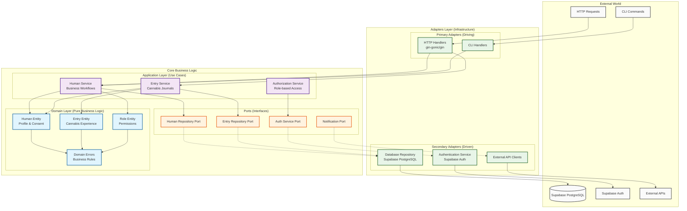

# CannaNote Backend

Backend service for CannaNote cannabis experience journaling platform, built with **hexagonal architecture** as the primary architectural pattern for maximum maintainability and growth potential.

## Architecture Overview

This backend implements **Hexagonal Architecture** (also known as Ports & Adapters) to achieve clean separation of concerns, high testability, and vendor-agnostic design. The architecture ensures that business logic remains pure and independent from external frameworks, databases, or delivery mechanisms.

### Hexagonal Architecture Diagram



### Core Principles

- **Core domain is pure** — No I/O, frameworks, or external dependencies in domain layer
- **Humans, not users** — Cannabis-focused terminology throughout the system
- **HIPAA-ready from day one** — Consent management and audit trails built-in
- **Dependency inversion** — Core depends on abstractions, never concretions
- **Manual dependency injection** — Explicit wiring for security and clarity
- **Port-driven development** — Contracts defined by business needs, not infrastructure

## Project Structure

```
backend/
├── cmd/                          # Application entry points
│   ├── api/main.go              # HTTP server entry point
│   └── web/                     # Web templates and assets
├── internal/                    # Private application code
│   ├── core/                    # Core business logic (hexagon center)
│   │   ├── domain/              # Pure business entities & rules
│   │   │   ├── human.go         # Human entity with cannabis preferences
│   │   │   ├── entry.go         # Cannabis experience entries (TODO)
│   │   │   └── errors.go        # Domain-specific error types
│   │   ├── application/         # Use cases & business workflows
│   │   │   ├── human_service.go # Human management use cases
│   │   │   └── entry_service.go # Entry management use cases (TODO)
│   │   └── ports/               # Interfaces (contracts)
│   │       ├── human_repository.go # Data persistence contracts
│   │       └── auth_service.go     # Authentication contracts
│   ├── adapters/                # External integrations (hexagon edges)
│   │   ├── http/                # Primary adapters (inbound)
│   │   │   └── human_handlers.go # REST API endpoints
│   │   ├── repository/          # Secondary adapters (outbound)
│   │   │   └── supabase_human_repository.go # PostgreSQL persistence
│   │   └── external/            # External service integrations
│   ├── server/                  # HTTP server configuration
│   │   ├── server.go           # Dependency injection & wiring
│   │   └── routes.go           # Route definitions
│   └── database/               # Database service abstraction
├── tests/                      # Test files
├── Makefile                    # Build automation
├── docker-compose.yml          # Local development database
└── go.mod                      # Go module definition
```

## Technology Stack

- **Language**: Go 1.22+ with modern features
- **Web Framework**: Gin (HTTP layer only)
- **Database**: Supabase PostgreSQL with Row Level Security
- **Authentication**: Supabase Auth (planned)
- **Templates**: Templ (type-safe HTML templates)
- **Frontend Enhancement**: HTMX for dynamic interactions
- **CSS**: Tailwind CSS via CDN
- **Architecture**: Hexagonal (Ports & Adapters)
- **Dependency Management**: Manual injection (no DI frameworks)

## Development Workflow

The hexagonal architecture supports multiple development approaches:

1. **Domain-First**: Start with pure business logic in `internal/core/domain/`
2. **Port Definition**: Define contracts in `internal/core/ports/`
3. **Application Services**: Implement use cases in `internal/core/application/`
4. **Adapter Implementation**: Build concrete implementations in `internal/adapters/`
5. **Integration**: Wire dependencies in `internal/server/server.go`

## Human Management Domain

The implemented Human Management domain demonstrates the hexagonal pattern:

- **Domain Entity**: `Human` with cannabis preferences and HIPAA-ready consent
- **Business Rules**: Profile validation, consent management, feature access
- **Application Service**: Registration, authentication, profile updates
- **Repository Port**: Data persistence contract
- **HTTP Adapter**: REST API with HATEOAS links
- **Supabase Adapter**: PostgreSQL implementation with JSON columns

## Getting Started

### Prerequisites

- Go 1.22 or later
- Make
- Docker (for local PostgreSQL)

### Development Commands

Build the application:
```bash
make build
```

Run the application:
```bash
make run
```

Start local database:
```bash
make docker-run
```

Stop local database:
```bash
make docker-down
```

Live reload during development:
```bash
make watch
```

Run the test suite:
```bash
make test
```

Clean build artifacts:
```bash
make clean
```

### Environment Variables

Required for database connection:
```bash
DB_HOST=localhost
DB_PORT=5432
DB_DATABASE=cannanote
DB_USERNAME=postgres
DB_PASSWORD=password
DB_SCHEMA=public
PORT=3001
```

## Future Roadmap

The hexagonal architecture supports seamless evolution:

1. **Entry Management** — Cannabis experience journaling domain
2. **Social Features** — Community interactions and sharing
3. **Medical Integration** — HIPAA compliance and provider partnerships
4. **Mobile API** — Shared domain models for mobile app
5. **Analytics** — Usage insights and recommendations
6. **Marketplace** — Dispensary and product integrations

## Development Principles

- **Testability**: Pure functions and dependency injection enable easy testing
- **Maintainability**: Clear separation of concerns and explicit dependencies
- **Extensibility**: New adapters can be added without changing core logic
- **Vendor Independence**: Business logic remains unaware of external frameworks
- **Security**: Manual DI prevents hidden dependencies and injection attacks