# CannaNote 2.0 Architecture Diagram

```mermaid
graph TB
    %% User Layer
    User[👤 Medical Cannabis Patient]
    Browser[🌐 Browser/Mobile]
    
    %% Frontend Layer  
    HTMX[⚡ HTMX + Tailwind CSS]
    Templates[📄 Go Templates]
    
    %% Load Balancer & CDN
    Fly[🚀 Fly.io Edge Locations]
    
    %% Application Layer
    subgraph "Docker Container - Production"
        GoApp[🔵 Go Application]
        Router[🔀 Chi Router]
        Middleware[🛡️ Auth/CORS/Security]
        
        subgraph "Go Services"
            AuthSvc[🔐 Auth Service]
            EntrySvc[📝 Entry Service] 
            ExportSvc[📤 Data Export Service]
            AuditSvc[📋 Audit Service]
        end
    end
    
    subgraph "Docker Container - Development"
        DevApp[🔵 Go Dev Server]
        HotReload[🔄 Air Hot Reload]
    end
    
    %% Database Layer
    subgraph "Supabase (HIPAA Compliant)"
        PostgreSQL[(🐘 PostgreSQL)]
        RLS[🔒 Row Level Security]
        Realtime[⚡ Realtime Subscriptions]
        Storage[🗂️ File Storage]
        EdgeFunctions[⚙️ Edge Functions]
    end
    
    %% External Auth
    OAuth[🔑 OAuth Providers<br/>Google, GitHub, Apple]
    
    %% Observability Stack (Free Tier)
    subgraph "Monitoring & Compliance"
        Sentry[🐛 Sentry<br/>Error Tracking]
        Grafana[📊 Grafana Cloud<br/>Metrics & Dashboards]
        OpenBao[🔐 OpenBao<br/>Secrets Management]
        Prometheus[📈 Prometheus<br/>Metrics Collection]
    end
    
    %% Backup & Security
    subgraph "Data Protection"
        Restic[💾 Restic<br/>Encrypted Backups]
        MinIO[📦 MinIO<br/>Object Storage]
        OWASP[🔍 OWASP ZAP<br/>Security Testing]
    end
    
    %% Payment Processing
    subgraph "Cannabis Banking"
        StripeAlt[💳 Cannabis-Friendly<br/>Payment Processors]
        CryptoPay[₿ Crypto Payment<br/>Rails]
    end
    
    %% Data Flow
    User --> Browser
    Browser --> Fly
    Fly --> HTMX
    HTMX --> GoApp
    GoApp --> Router
    Router --> Middleware
    Middleware --> AuthSvc
    Middleware --> EntrySvc
    Middleware --> ExportSvc
    
    %% Database Connections
    AuthSvc --> PostgreSQL
    EntrySvc --> PostgreSQL
    ExportSvc --> PostgreSQL
    AuditSvc --> PostgreSQL
    
    %% Auth Flow
    AuthSvc --> OAuth
    AuthSvc --> Supabase
    RLS --> PostgreSQL
    
    %% Observability Connections
    GoApp --> Sentry
    GoApp --> Prometheus
    Prometheus --> Grafana
    GoApp --> OpenBao
    
    %% HIPAA Compliance
    AuditSvc --> Sentry
    PostgreSQL --> Restic
    Restic --> MinIO
    
    %% Development Flow
    DevApp --> HotReload
    HotReload --> Templates
    
    %% Payment Flow
    GoApp --> StripeAlt
    GoApp --> CryptoPay
    
    %% Security Testing
    OWASP --> GoApp
    
    %% Styling
    classDef primary fill:#2563eb,stroke:#1d4ed8,stroke-width:2px,color:white
    classDef secondary fill:#10b981,stroke:#059669,stroke-width:2px,color:white
    classDef compliance fill:#dc2626,stroke:#b91c1c,stroke-width:2px,color:white
    classDef database fill:#7c3aed,stroke:#6d28d9,stroke-width:2px,color:white
    
    class GoApp,Router,AuthSvc,EntrySvc primary
    class Sentry,OpenBao,Grafana compliance
    class PostgreSQL,Supabase,Storage database
    class HTMX,Fly secondary
```

## Architecture Overview

### Key Design Principles

**🔴 HIPAA Compliance Layer**: Red components handle patient data with encryption, audit trails, and access controls

**🔵 Application Core**: Go services with clear separation of concerns and HATEOAS principles

**🟢 Edge & Performance**: HTMX + Fly.io for fast, interactive UX without SPA complexity

**🟣 Data Layer**: Supabase provides HIPAA-compliant PostgreSQL with built-in RLS and realtime features

### Critical Data Flow Patterns

1. **Patient Data**: Always flows through RLS policies in Supabase
2. **Audit Events**: Dual-written to Supabase + Sentry for compliance redundancy  
3. **Secrets**: Never touch application code (OpenBao injection)
4. **Payments**: Abstracted interface for cannabis banking flexibility

### Free Tier Resource Summary

**Total Monthly Costs: $0-25** (vs $200-500+ for enterprise solutions)

| Service | Free Tier | Compliance Value |
|---------|-----------|------------------|
| Sentry | 5K errors/month | Error audit trails |
| Grafana Cloud | 10K metrics | SOC2 monitoring |
| Supabase | 50K MAU | HIPAA infrastructure |
| Fly.io | $5/month | SOC2 certified hosting |
| OpenBao | Unlimited | Secrets management |

This architecture gives you enterprise compliance on startup resources while maintaining the agility to pivot if regulations change.