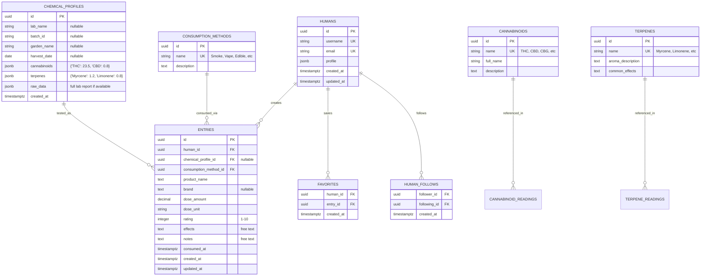

# CannaNote Supabase Configuration

Science-driven cannabis platform database schema with efficient JSONB storage and automated reference data updates.

## Setup

### Initial Setup
```bash
# Install Supabase CLI
npm install -g supabase

# Link to your project (replace with your project ref)
supabase link --project-ref citdskdmralncvjyybin

# Pull existing schema (if any)
supabase db pull

# Start local development environment
supabase start
```

### Database Setup
```bash
# Apply schema and seed data
supabase db reset

# Or apply specific files:
psql --host=db.citdskdmralncvjyybin.supabase.co \
     --port=5432 \
     --username=postgres \
     --dbname=postgres \
     --file=seed.sql

# Update reference data (cannabinoids, terpenes)
psql --host=db.citdskdmralncvjyybin.supabase.co \
     --port=5432 \
     --username=postgres \
     --dbname=postgres \
     --file=reference-data/cannabinoids.sql

psql --host=db.citdskdmralncvjyybin.supabase.co \
     --port=5432 \
     --username=postgres \
     --dbname=postgres \
     --file=reference-data/terpenes.sql
```

### Local Development
```bash
# Start local Supabase (includes Studio UI at localhost:54323)
supabase start

# Reset local database with fresh schema/data
supabase db reset

# Generate TypeScript types from schema
supabase gen types typescript --local > types/database.types.ts
```

### Production Deployment
```bash
# Push schema changes to production
supabase db push

# Deploy edge functions (if any)
supabase functions deploy
```

## Database Structure

### Core Tables (6 entities for efficiency)
- **`humans`**: User profiles with cannabis preferences and medical tags
- **`entries`**: Cannabis consumption experiences with effects logging
- **`chemical_profiles`**: Lab test data using JSONB for cannabinoids/terpenes
- **`cannabinoids`**: Reference data (THC, CBD, CBG, etc.) with descriptions
- **`terpenes`**: Reference data (Myrcene, Limonene, etc.) with effects
- **`consumption_methods`**: Reference data (smoke, vape, edible, etc.)

### JSONB Efficiency Benefits
```sql
-- Traditional: 50+ rows per lab test
-- JSONB: 1 row per lab test with nested data
{
  "cannabinoids": {"THC": 23.5, "CBD": 0.8, "CBG": 1.2},
  "terpenes": {"Myrcene": 1.2, "Limonene": 0.8, "Pinene": 0.6}
}

-- Fast queries with GIN indexes:
SELECT * FROM chemical_profiles WHERE cannabinoids ? 'CBD';
SELECT * FROM chemical_profiles WHERE (cannabinoids->>'THC')::numeric > 20;
```

### Security & Privacy
- **Row Level Security (RLS)** on personal data (`humans`, `entries`, `favorites`)
- **Public reference data** for scientific benefit (`chemical_profiles`, `cannabinoids`, `terpenes`)
- **Smart RLS policies**: Own data + public entries from followed users
- **Tag-based filtering**: Medical conditions as optional tags, not required fields

### Reference Data Management
- **Automated updates**: RSS feeds and APIs for fresh cannabinoid/terpene data
- **Separate files**: `reference-data/cannabinoids.sql`, `reference-data/terpenes.sql`
- **Version control**: Track changes to reference data over time
- **Community contribution**: Scientific accuracy through crowd-sourced corrections

## Planned Features

### Phase 1 (MVP)
- **Core journaling**: Consumption tracking with effects
- **Chemical correlation**: Link lab results to personal effects
- **Social discovery**: Follow users with similar conditions/preferences
- **Tag analytics**: Track most popular medical tags by season/time

### Phase 2 (Scale)
- **Real-time sync**: Mobile/web synchronization via Supabase realtime
- **Pattern recognition**: Identify personal optimal chemical profiles
- **Data visualization**: Charts showing chemical profile effectiveness
- **Community insights**: Aggregate anonymized effectiveness data

### Phase 3 (Advanced)
- **Lab integrations**: API connections to testing companies
- **Grower partnerships**: QR codes linking products to grow data
- **Research platform**: Anonymized data for cannabis research institutions
- **Export capabilities**: Personal data export for medical consultations

# ERD

